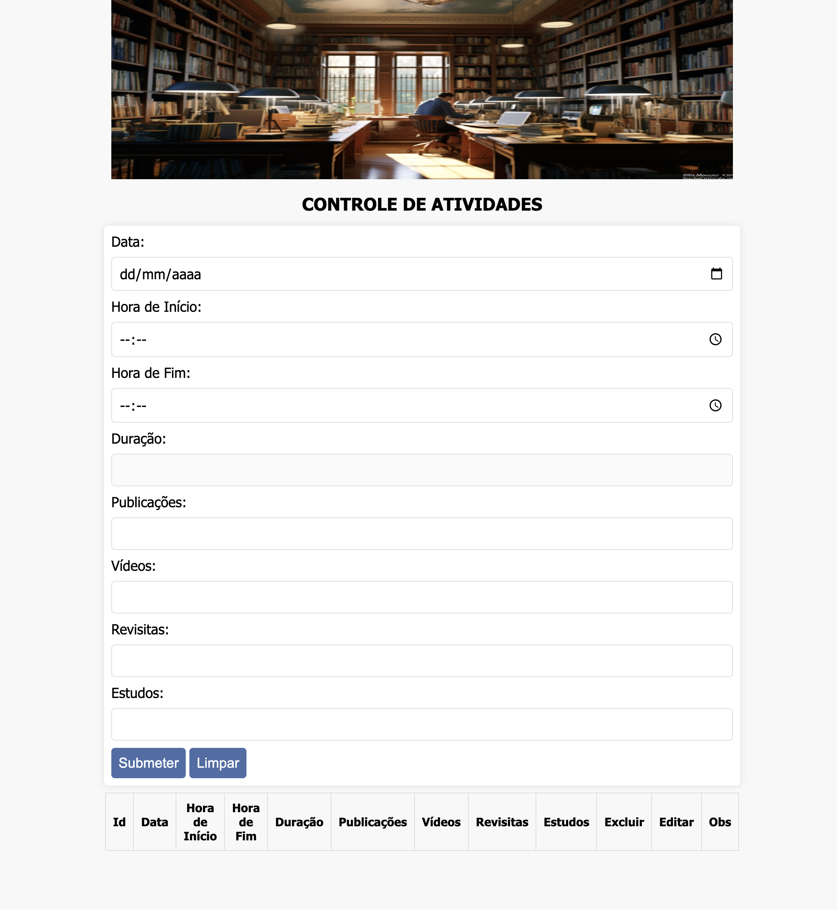

#
&nbsp;
&nbsp;


# Sobre o MVP
A aplicação consiste no projeto de conclusão da Sprint 1 do Curso de **Desenvolvimento Full Stack** na PUC-Rio, e trata-se de um controle de atividades de serviço de campo. O Publicador de Boas Novas, pode registrar suas atividades diárias de trabalho.

# Tecnologias
+ Python
+ Flask
+ OpenAPI
+ SQLite
+ SQLAlchemy
+ HTML5
+ CSS3
+ JavaScrip

# Como executar?

A aplicação está dividida em 2 repositórios, sendo:
- > [Back-end] https://github.com/mjosejunior/mvp_jrmj_sp1_back

- Front-end (Este repositório)

- > [Vídeo de Visão Geral do Projeto] https://youtu.be/elgTpzwykfo

Basta fazer o download do projeto e abrir o arquivo index.html no seu browser.

```powershell
# Acesse a pasta do da aplicação ou 
# Execute o arquivo index.html para abrir o front-end em seu browser
```

Em caso de dificuldades, por favor, entre em contato.